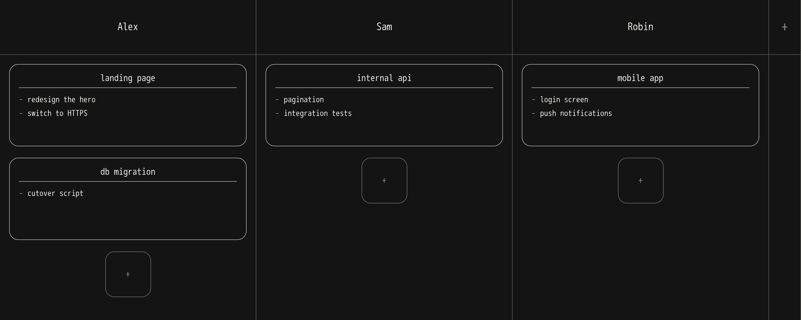

# miniPlanner

A minimal board to see, at a glance, what everyone is working on.
One column per person, cards you drag around, everything edited in place.

[](LICENSE)




## Why

No accounts, no sprints, no notifications. Just a shared wall, left open in a tab,
where the team drops what they currently have in flight.

- **One column per person**, one card per topic, one line per task.
- **Drag and drop** cards, across columns too.
- **Everything is edited by clicking** — no forms, no modals.
- **No client-side build**: neither npm nor a bundler is needed to run the app.
- **One Python dependency**: Flask. Data lives in a single SQLite file.

## Getting started

The only thing to install is [uv](https://docs.astral.sh/uv/), which takes care of
the rest, Python included:

```bash
curl -LsSf https://astral.sh/uv/install.sh | sh
```

Then:

```bash
git clone git@github.com:ccrisinel/miniPlanner.git
cd miniPlanner
uv run miniplanner          # http://localhost:5000
```

That's it, there is no install step. `uv run` creates the virtual environment,
installs the dependencies pinned in `uv.lock` and starts the server; the database
is created on first launch. To only prepare the environment without starting it,
run `uv sync`.

### Configuration

| Variable            | Default                   | Purpose                                                    |
|---------------------|---------------------------|------------------------------------------------------------|
| `MINIPLANNER_HOST`  | `0.0.0.0`                 | All interfaces; use `127.0.0.1` to restrict to the machine |
| `MINIPLANNER_PORT`  | `5000`                    |                                                            |
| `MINIPLANNER_DB`    | `src/instance/planner.db` | Path to the SQLite file (`/data/planner.db` in Docker)     |
| `MINIPLANNER_DEBUG` | `0`                       | `1` enables auto-reload (development)                      |

By default the server listens on every interface, so colleagues can reach it over
the local network. There are no accounts and no passwords: only expose it on a
network you trust.

## Docker

Images are published to the GitHub Container Registry for `linux/amd64` and
`linux/arm64` on every push to `main`, so there is nothing to build:

```bash
docker run -d -p 8000:8000 -v planner-data:/data \
  ghcr.io/ccrisinel/miniplanner:latest
```

Or through compose, which is what `compose.yaml` describes:

```bash
docker compose pull && docker compose up -d     # http://localhost:8000
```

`latest` follows `main`, `sha-<short>` pins a single commit, and pushing a `v*` git
tag publishes that version. To build the image yourself rather than pull it, run
`docker compose up -d --build`.

The image runs gunicorn — not the development server — as an unprivileged user.
The board lives in a `planner-data` volume mounted at `/data`; backing up means
copying `planner.db` out of it.

Built in two stages on `python:3.13-alpine`, it weighs around 24 MB compressed and
37 MB on disk. It ships two gthread workers, which suits a small team; override the
command to change that:

```bash
docker run -p 8000:8000 -v planner-data:/data miniplanner \
  gunicorn "miniplanner:create_app()" --bind 0.0.0.0:8000 \
  --workers 4 --worker-class gthread --threads 4
```

SQLite runs in WAL mode with a busy timeout, so several workers can share the file
without tripping over each other.

### Without Docker

The built-in server is a development server. For shared use, put a real WSGI server
in front:

```bash
uv run --extra prod gunicorn "miniplanner:create_app()" -b 0.0.0.0:8000
```

Backing up means copying the SQLite file.

## Usage

- **Add a person**: the `+` in the narrow column on the right.
- **Add a card**: the `+` at the bottom of a column.
- **Add a line**: the `- ajouter` field at the bottom of a card. `Enter` moves on to
  the next line without reaching for the mouse.
- **Edit**: click a name, a title or a line.
- **Delete**: the `×` that appears on hover. Clearing a line deletes it too.
- **Move a card**: drag it. The new order is saved immediately. Grab the card by its
  margins — titles and lines stay clickable.

In every field, `Enter` confirms and `Esc` cancels. `Shift+Enter` inserts a line
break instead of confirming, in card titles as well as task lines. Clicking away also
confirms: what you filled in is saved, what you left empty is dropped (a card just
created and left untitled disappears on its own).

Long text wraps onto as many lines as it needs and the card grows accordingly —
nothing is ever cut off.

Note that the interface itself is in French.

## Development

```
src/miniplanner/
├── app.py                    application factory + routes
├── db.py                     schema and SQLite access
├── styles/input.css          Tailwind source
├── static/
│   ├── css/app.css           compiled stylesheet (checked in)
│   └── js/                   htmx 4, SortableJS, board.js
└── templates/
    ├── base.html
    ├── board.html
    └── partials/             board / column / card
```

The server returns HTML fragments, never JSON: every mutation returns the card, the
column or the board it touched, and htmx swaps it into the page. `POST /reorder` is
the one exception — it receives the full card ordering after a drag and replies
`204`.

htmx and SortableJS are vendored under `static/js/`, and the compiled Tailwind
stylesheet is checked in. The app therefore runs without Node and without a CDN. To
work on the styles:

```bash
npm install
npm run css          # single minified pass
npm run css:watch    # continuously, while developing
```

Without `MINIPLANNER_DEBUG=1`, Jinja caches templates: restart the server after
editing one.

## License

[GNU AGPL v3](LICENSE) or later.

If you deploy a modified version that users reach over a network, the AGPL requires
you to offer them its source (section 13).
